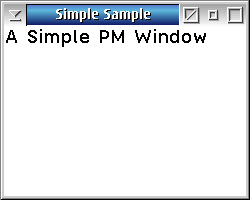

# DEV-SAMPLES-C-PM-Simple

A Simple PM Window sample application for OS/2 Presentation Manager.



## Description

This is a minimal OS/2 Presentation Manager (PM) application written in C. It demonstrates fundamental PM programming concepts by creating a standard frame window with a custom client area that accepts and displays keyboard input with automatic word-wrapping.

The program registers a custom window class (`MyWindow`) that allocates per-instance storage for a text buffer. Characters typed by the user are appended to the buffer and drawn in the client area using `WinDrawText` with word-break support. Pressing **F3** exits the application.

## Features

- Standard PM frame window with title bar, system menu, min/max buttons, and sizing border
- Custom window class registration with per-instance data storage
- Keyboard input handling — characters are accumulated and displayed
- Word-wrapped text rendering in the client area using GPI
- Window text protocol support (`WM_SETWINDOWPARAMS` / `WM_QUERYWINDOWPARAMS`)
- F3 key shortcut to exit

## Requirements

- OS/2 Warp 4.5x or later (including ArcaOS)
- GCC 9.2 (bitwiseworks / kLIBC) or OpenWatcom 2.0 C compiler

Install build tools on ArcaOS:
```
yum install git gcc make libc-devel binutils watcom-wrc watcom-wlink-hll watcom-wipfc
```

## Directory Structure

```
├── src/                    Source files
│   ├── simple.c           Main source file
│   ├── simple.h           Header file
│   ├── simple.def         Module definition file (BLDLEVEL)
│   ├── simple.ico         Application icon
│   └── simple-ow.lnk     OpenWatcom linker directives
├── bin-gcc/               GCC build output (created by build)
├── bin-ow/                OpenWatcom build output (created by build)
├── wiki/                  Screenshots
│   └── Simple_001.png     Application screenshot
├── compile-gcc.cmd        GCC build script
├── compile-ow.cmd         OpenWatcom build script
├── makefile-gcc            GCC makefile
├── makefile-ow             OpenWatcom makefile
├── .gitignore             Git ignore rules
├── LICENSE                BSD 3-Clause License
└── README.md              This file
```

## Building

### Using GCC

```bash
# Using the compile script
compile-gcc.cmd

# Using make directly
make -f makefile-gcc
```

Output: `bin-gcc\simple.exe`

### Using OpenWatcom

```bash
# Using the compile script
compile-ow.cmd

# Using wmake directly
wmake -f makefile-ow
```

Output: `bin-ow\simple.exe`

### Cleaning build artifacts

```bash
make -f makefile-gcc clean
wmake -f makefile-ow clean
```

## BLDLEVEL Information

The executable includes BLDLEVEL information that can be queried using the OS/2 `bldlevel` command:

```
bldlevel simple.exe
```

## Compile Notes

This version of this sample was modified to compile on ArcaOS with GCC 9 compiler.

1. Make sure you have the correct header files in your path. For GCC the correct ones are included in `libc-devel`, not the ones from the OS/2 Toolkit. Check your `config.sys` for `SET INCLUDE=C:\usr\include`.

2. Since the Watcom Resource Compiler (open source) and Watcom Linker are used instead of the classic `rc.exe` and `ilink.exe`, add to your `config.sys`:
   ```
   SET EMXOMFLD_LINKER=wl.exe
   SET EMXOMFLD_TYPE=WLINK
   SET EMXOMFLD_RC_TYPE=WRC
   SET EMXOMFLD_RC=wrc.exe
   ```

3. Run `compile-gcc.cmd` or `make -f makefile-gcc` to build. The compile script sets these environment variables automatically.

## Version History

- **1.03** - 2026-07-24
  - Reorganised directory structure (source files in `src/`, build outputs in `bin-gcc/` and `bin-ow/`)
  - Added OpenWatcom build support (makefile-ow, compile-ow.cmd, simple-ow.lnk)
  - Improved source code documentation
  - Improved README documentation
  - Added .gitignore

- **1.01** - 2023-07-16
  - Changed version to compile on GCC and to run on ArcaOS 5.0.7

- **1.0**
  - Original version

## License

BSD 3-Clause License — see [LICENSE](LICENSE) file for details.

## Authors

- Martin Iturbide / OS2World (2023)
- Original Author

## Links

- https://github.com/OS2World/DEV-SAMPLES-C-PM-Simple
